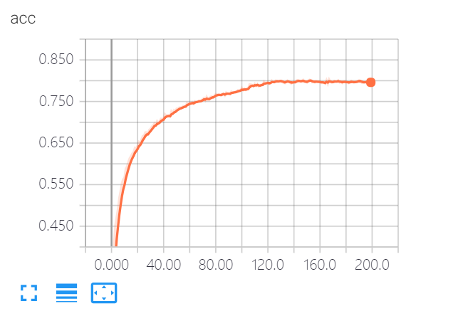
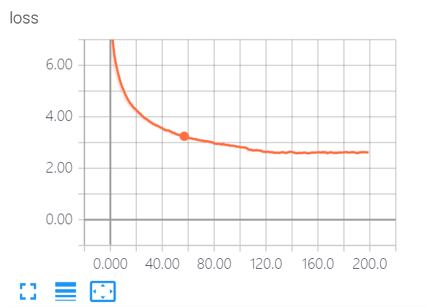
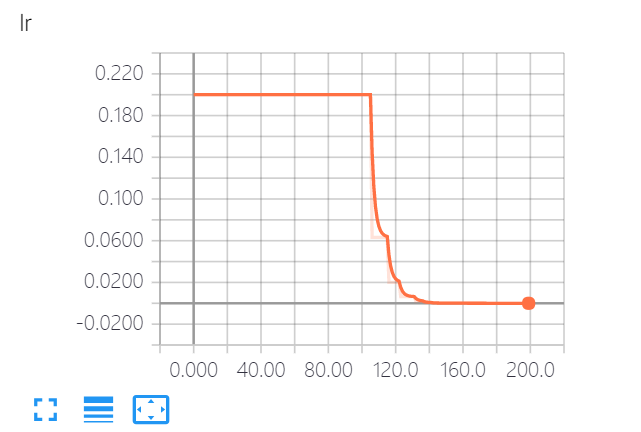
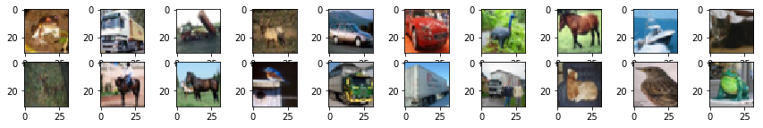
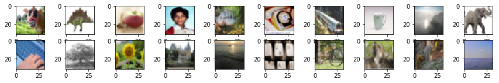

# keras-lbl-IvS

论文地址：[Large-scale Bisample Learning on ID vs. Spot Face Recognition](https://arxiv.org/pdf/1806.03018.pdf)

工程地址：[keras-lbl-IvS](https://github.com/yizt/keras-lbl-IvS)

​        keras实现人证比对论文《Large-scale Bisample Learning on ID vs. Spot Face Recognition》的核心思想; 当类别数非常大时(超过百万)，GPU显存可能无法装载权重参数；可以使用支配原型概念，每个step将相关的类别一块训练，step开始时将当前mini-batch的类别原型权重加载到GPU中，而不用加载所有的类别权重参数; step结束时更新并保存当前训练类别的原型权重。

​        由于目前没有公开证件数据集;这里使用cifar10和cifar100数据集做简单的模拟测试；先说结果，直接使用cifar10数据集训练，使用imprint生成初始的cifar100数据集的类别权重；在初始的权重中测试精度为20.8%,可以说是一个不错的初始化状态；每次使用30个类别做支配原型训练，训练的精度约为80%；使用训练后的原型权重再整体测试cifar100类，最终精度为57.4%; 效果任然不太理想。一方面支配原型训练优化应该更加困难；另一方面也没有测试更多的超参数选择(支配训练类别数、支配队列大小、候选队列大小、margin、scale、batch-size、lr等等)。

​        但以上测试结果仍然能够说明此方法是可行的；至少在类别数特别大时(GPU无法装下),使用用支配原型权重概念，在训练时动态加载当前训练类别的权重的是一个不错的方法。

​         欢迎关注、反馈问题和沟通交流... ...

下图为支配原型训练的acc,loss和lr信息：



​       

​       

​        以下是测试过程，目录如下：

[TOC]

## 依赖环境

* python 3.6
* tensorflow-gpu 1.9.0
* keras 2.2.0
* faiss 1.4.0
* h5py 2.8.0


## 初始化环境


```python
import tensorflow as tf
import numpy as np
import h5py
import keras
from keras.layers import Input
from keras.models import Model
from keras.optimizers import SGD
from keras.datasets import cifar10,cifar100
import keras.backend as K
from keras.callbacks import ModelCheckpoint, ReduceLROnPlateau, TensorBoard
import sys
import os
import time
import argparse

if __package__ is None:
    sys.path
    sys.path.insert(0, '/opt/github/py_data_mining/face')
    __package__ = "keras-lbl-IvS"
    
from .config import Config
from .utils import random_select, get_weights, update_weights, update_queue
from .faiss_utils import get_index, update_multi
```

    /root/anaconda3/envs/keras/lib/python3.6/importlib/_bootstrap.py:219: RuntimeWarning: numpy.dtype size changed, may indicate binary incompatibility. Expected 96, got 88
      return f(*args, **kwds)
    /root/anaconda3/envs/keras/lib/python3.6/importlib/_bootstrap.py:219: RuntimeWarning: numpy.dtype size changed, may indicate binary incompatibility. Expected 96, got 88
      return f(*args, **kwds)
    Using TensorFlow backend.


### 配置信息


```python
class CifarConfig(Config):
    # 输入信息
    input_shape = (32, 32, 3)
    num_classes = 100  # cifar100
    train_num_classes = 30  # 支配原型训练的类别数

    # 训练参数
    batch_size = 256

    # 原型权重保存
    prototype_weights_hdf5 = '/tmp/cifar_prototype_weights.hdf5'
    prototype_weights_dataset = 'cifar_prototype_weights_set'
    pw_h5_file = None  # hdf5 File文件

    index = None  # 保存原型类别的faiss索引

    dominant_queue = None  # 支配队列
    candidate_queue = None  # 候选队列

    dominant_queue_num = 20  # 支配队列大小
    candidate_queue_num = 50  # 候选队列大小

config = CifarConfig()
```


```python
def set_gpu_growth():
    os.environ["CUDA_VISIBLE_DEVICES"] = "0"
    cfg = tf.ConfigProto()
    cfg.gpu_options.allow_growth = True
    session = tf.Session(config=cfg)
    K.set_session(session)
    
set_gpu_growth()
```


```python
import matplotlib.pyplot as plt
def img_show(X, rows, cols):
    plt.figure(figsize=(cols * 1.5, rows))
    for i, img in enumerate(X[:rows * cols]):
        plt.subplot(rows, cols, 1 + i)
        plt.imshow(img)
    plt.show()
```

## 源数据集训练

使用cifar10 作为源数据集

### cifar10 数据集加载、可视化


```python
(x_train, y_train), (x_test, y_test) = cifar10.load_data()
```


```python
img_show(x_train,2,10)
```





### 骨干网络定义

骨干网络，提取特征


```python
# 骨干网络，提取特征
import keras.layers as layers
def cifar_base_net(inputs):
    """
    骨干网络、用于提取特征
    :param inputs: keras Input对象
    :return: 
    """
    x = layers.Conv2D(32, (3, 3), padding='same', name='conv_1')(inputs)
    x = layers.BatchNormalization(axis=3, name='bn_conv1')(x)
    x = layers.Activation('relu')(x)
    x = layers.Conv2D(32, (3, 3), name='conv_2')(x)
    x = layers.Activation('relu')(x)
    x = layers.MaxPooling2D(pool_size=(2, 2))(x)
    x = layers.Dropout(0.25)(x)

    x = layers.Conv2D(64, (3, 3), padding='same', name='conv_3')(x)
    x = layers.Activation('relu')(x)
    x = layers.Conv2D(64, (3, 3), name='conv_4')(x)
    x = layers.Activation('relu')(x)
    x = layers.MaxPooling2D(pool_size=(2, 2))(x)
    x = layers.Dropout(0.25)(x)

    x = layers.Conv2D(512, (3, 3), name='conv_5')(x)
    x = layers.Activation('relu')(x)
    x = layers.GlobalAvgPool2D()(x)

    return x
```

### AMSoftmax分类层定义

关于AMSoftmax的详细信息见论文:[Additive Margin Softmax for Face Verification](https://arxiv.org/abs/1801.05599)


```python
from keras.layers import Layer
class DenseWithAMSoftmaxLoss(Layer):

    def __init__(self, num_classes, m=0.35, scale=30, **kwargs):
        """
        根据Additive Margin Softmaxfor Face Verification论文设置m和scale
        :param num_classes: 类别数
        :param m: margin间隔
        :param scale: 尺度
        :param kwargs:
        """
        self.output_dim = num_classes
        self.m = m
        self.scale = scale
        super(DenseWithAMSoftmaxLoss, self).__init__(**kwargs)

    def build(self, input_shape):
        # 添加可训练参数
        self.kernel = self.add_weight(name='kernel',
                                      shape=(input_shape[1], self.output_dim),
                                      initializer='glorot_normal',
                                      trainable=True)

    def call(self, inputs):
        self.inputs = inputs
        # L2归一化
        self.w_norm = K.tf.nn.l2_normalize(self.kernel, 0, 1e-10)
        self.x_norm = K.tf.nn.l2_normalize(self.inputs, 1, 1e-10)
        self.logits = K.dot(self.x_norm, self.w_norm)
        return self.logits

    def compute_output_shape(self, input_shape):
        return (input_shape[0],  # batch_size
                self.output_dim)

    def loss_dense(self, y_true, y_pred):
        """
        AmSoftmax Loss
        :param y_true: 真实类别 [N,num_classes]
        :param y_pred: 预测类别[N,num_classes]
        :return:
        """
        y_true = K.cast(y_true, 'float32')
        thelta_m = y_pred - y_true * self.m  # cosine(thelta)-m ; y_true 就相当于mask

        return K.categorical_crossentropy(y_true, self.scale * thelta_m, from_logits=True)

```

### 构建模型


```python
from keras.models import Model
from keras.layers import Dense
from keras import Input

def source_model(img_inputs,num_class):
    features=cifar_base_net(img_inputs)
    dense=DenseWithAMSoftmaxLoss(num_class,m=0.2,scale=24.,name='amsoftmax')   # 使用自定义的AMSoftMax分类层 
    output=dense(features)
    m = Model(img_inputs,output)
    m.compile(optimizer=keras.optimizers.Adam(lr=0.001,decay=1e-6),
          loss=dense.loss_dense,
          metrics=['accuracy'])
    return m

img_input=Input(shape=(32,32,3))
m = source_model(img_input,10)  # cifar10 一共10类
m.summary()
```

    WARNING:tensorflow:From /root/anaconda3/envs/keras/lib/python3.6/site-packages/keras/backend/tensorflow_backend.py:3216: softmax_cross_entropy_with_logits (from tensorflow.python.ops.nn_ops) is deprecated and will be removed in a future version.
    Instructions for updating:
    
    Future major versions of TensorFlow will allow gradients to flow
    into the labels input on backprop by default.
    
    See @{tf.nn.softmax_cross_entropy_with_logits_v2}.
    
    _________________________________________________________________
    Layer (type)                 Output Shape              Param #   
    =================================================================
    input_1 (InputLayer)         (None, 32, 32, 3)         0         
    _________________________________________________________________
    conv_1 (Conv2D)              (None, 32, 32, 32)        896       
    _________________________________________________________________
    bn_conv1 (BatchNormalization (None, 32, 32, 32)        128       
    _________________________________________________________________
    activation_1 (Activation)    (None, 32, 32, 32)        0         
    _________________________________________________________________
    conv_2 (Conv2D)              (None, 30, 30, 32)        9248      
    _________________________________________________________________
    activation_2 (Activation)    (None, 30, 30, 32)        0         
    _________________________________________________________________
    max_pooling2d_1 (MaxPooling2 (None, 15, 15, 32)        0         
    _________________________________________________________________
    dropout_1 (Dropout)          (None, 15, 15, 32)        0         
    _________________________________________________________________
    conv_3 (Conv2D)              (None, 15, 15, 64)        18496     
    _________________________________________________________________
    activation_3 (Activation)    (None, 15, 15, 64)        0         
    _________________________________________________________________
    conv_4 (Conv2D)              (None, 13, 13, 64)        36928     
    _________________________________________________________________
    activation_4 (Activation)    (None, 13, 13, 64)        0         
    _________________________________________________________________
    max_pooling2d_2 (MaxPooling2 (None, 6, 6, 64)          0         
    _________________________________________________________________
    dropout_2 (Dropout)          (None, 6, 6, 64)          0         
    _________________________________________________________________
    conv_5 (Conv2D)              (None, 4, 4, 512)         295424    
    _________________________________________________________________
    activation_5 (Activation)    (None, 4, 4, 512)         0         
    _________________________________________________________________
    global_average_pooling2d_1 ( (None, 512)               0         
    _________________________________________________________________
    amsoftmax (DenseWithAMSoftma (None, 10)                5120      
    =================================================================
    Total params: 366,240
    Trainable params: 366,176
    Non-trainable params: 64
    _________________________________________________________________


### 训练模型


```python
(x_train, y_train), (x_test, y_test) = cifar10.load_data()
m.fit(x_train, keras.utils.to_categorical(y_train,10),
              batch_size=64,
              epochs=10,
              validation_data=(x_test, keras.utils.to_categorical(y_test,10)),
              shuffle=True)
```

    Train on 50000 samples, validate on 10000 samples
    Epoch 1/10
    50000/50000 [==============================] - 8s 153us/step - loss: 5.6485 - acc: 0.4251 - val_loss: 4.8240 - val_acc: 0.5428
    Epoch 2/10
    50000/50000 [==============================] - 6s 129us/step - loss: 4.1562 - acc: 0.6204 - val_loss: 3.5912 - val_acc: 0.6834
    Epoch 3/10
    50000/50000 [==============================] - 7s 136us/step - loss: 3.4796 - acc: 0.6930 - val_loss: 3.1658 - val_acc: 0.7277
    Epoch 4/10
    50000/50000 [==============================] - 7s 137us/step - loss: 3.0975 - acc: 0.7322 - val_loss: 2.9639 - val_acc: 0.7396
    Epoch 5/10
    50000/50000 [==============================] - 7s 135us/step - loss: 2.8483 - acc: 0.7540 - val_loss: 3.1497 - val_acc: 0.7251
    Epoch 6/10
    50000/50000 [==============================] - 7s 131us/step - loss: 2.6558 - acc: 0.7757 - val_loss: 3.0899 - val_acc: 0.7297
    Epoch 7/10
    50000/50000 [==============================] - 6s 128us/step - loss: 2.5169 - acc: 0.7885 - val_loss: 2.6846 - val_acc: 0.7680
    Epoch 8/10
    50000/50000 [==============================] - 7s 136us/step - loss: 2.4056 - acc: 0.7990 - val_loss: 2.8013 - val_acc: 0.7623
    Epoch 9/10
    50000/50000 [==============================] - 7s 136us/step - loss: 2.3017 - acc: 0.8082 - val_loss: 2.4712 - val_acc: 0.7900
    Epoch 10/10
    50000/50000 [==============================] - 7s 131us/step - loss: 2.2125 - acc: 0.8167 - val_loss: 2.4762 - val_acc: 0.7867


    <keras.callbacks.History at 0x7f15b406be80>


```python
# 保存模型
m.save('/tmp/source.weights.h5')
```

## 初始评估

使用在源数据集cifar10上训练的模型，来评估在cifar100上的精度;评估方式是通过imprint构建初始的分类权重;
imprint详见[Low-Shot Learning with Imprinted Weights](https://arxiv.org/abs/1712.07136)论文，相关代码见[keras-imprinting](https://github.com/yizt/keras-imprinting).


### cifar100 数据加载、可视化


```python
(x_train, y_train), (x_test, y_test) = cifar100.load_data()
```


```python
img_show(x_train,2,10)
```





### 初始原型权重

使用imprint方式将cifar100的类别原型权重保持到hdf5中(虽然这里只有100类，但是也按照类别上百万的方式来实现)


```python
# 类别分组
def label_id_map(labels, num_class):
    """
    将图像按照类别分组
    """
    # 初始化
    label_id_dict = dict()
    for i in range(num_class):
        label_id_dict[i] = []

    # 逐个图像归类
    for img_id in range(len(labels)):
        label_id_dict[labels[img_id]].append(img_id)
    return label_id_dict
label_id_dict = label_id_map(y_train[:,0], config.num_classes)  # y_train (5000,1)
```


```python
# 初始化原型权重
def init_prototype(pretrained_weights, X, label_id_dict, num_class):
    inputs = Input(batch_shape=(config.batch_size,) + config.input_shape)
    features = cifar_base_net(inputs)
    model = Model(inputs, features)
    model.load_weights(pretrained_weights, by_name=True)
    # 原型权重一份放到hdf5，一份存放到faiss中(faiss中保留的不是精准的)
    if os.path.exists(config.prototype_weights_hdf5):
        os.remove(config.prototype_weights_hdf5)
    f_label = h5py.File(config.prototype_weights_hdf5, 'w')
    label_feature = f_label.create_dataset(config.prototype_weights_dataset,
                                           shape=(num_class, 512), dtype='f')

    # 逐个类别处理
    for label in range(num_class):
        # 获取某个label的所有图像，并使用模型预测图像的特征，最后求均值作为label的原型权重
        image_ids = label_id_dict[label]  # 图像id
        images = X[image_ids]  # 图像数据
        features = model.predict(np.asarray(images))  # 输出特征
        features = keras.utils.np_utils.normalize(features)  # 归一化
        features = np.mean(features, axis=0)  # 求均值
        features = keras.utils.np_utils.normalize(features)  # 再次归一化; 是二维的

        # 赋值给hdf5
        label_feature[label] = features[0]  # (1,d) 转为 (d,)
        # 每1w次，刷写到磁盘
        if label % 1000 == 0:
            f_label.flush()
            print("{} init_prototype 完成：{}".format(time.strftime("%Y-%m-%d %H:%M:%S", time.localtime()),
                                                   label))
    f_label.flush()
    # 最后关闭文件
    f_label.close()
```


```python
init_prototype('/tmp/source.weights.h5',x_train,
               label_id_dict,
               config.num_classes)
```

    2019-01-14 23:11:57 init_prototype 完成：0


### 开始评估


```python
# 定义评估函数
from keras.layers import Dense
def evaluate(pretrained_weights, X, y, num_class, use_amsoftmax=False):
    if use_amsoftmax:
        dense = DenseWithAMSoftmaxLoss(num_class, m=0.2, scale=24.,name='other')  # name='other'
    else:
        dense = layers.Dense(num_class, use_bias=False, activation='softmax')
    # 构建模型
    inputs = Input(shape=config.input_shape)
    features = cifar_base_net(inputs)
    outputs = dense(features)
    m = Model(inputs, outputs)

    m.load_weights(pretrained_weights, by_name=True)

    # 设置分类层的权重
    f_label = h5py.File(config.prototype_weights_hdf5, 'r')
    weights = f_label[config.prototype_weights_dataset]  # HDF5 dataset object
    m.layers[-1].set_weights([np.transpose(weights[:])])  # 使用weights[:]转为numpy
    # 最后关闭文件
    f_label.close()
    #m.summary()

    # 评估预测
    y_pred = m.predict(X)
    y_pred = np.argmax(y_pred, axis=-1)

    print("acc:{}".format(np.mean(np.equal(y,y_pred))))
```


```python
evaluate('/tmp/source.weights.h5', x_test,y_test[:,0],config.num_classes,True)
```

    acc:0.2081


<font color="FF0000">可以看到直接使用imprint方式初始化类别权重参数，在cifar100的精度超过20%；是随机精度1%的20倍；</font>

## 支配原型训练cifar100

### 获取原型

获取保持在hdf5中的初始原型权重;并将所有的权重加载到faiss的索引中，用于候选构造支配队列和候选队列


```python
def get_prototype(deal_batch=1000):
    f_label = h5py.File(config.prototype_weights_hdf5, 'r+')
    dset = f_label[config.prototype_weights_dataset]
    length = len(dset)
    index = get_index(512)
    # 逐个类别处理,更新faiss index
    for batch_no in range(length // deal_batch):
        start = batch_no * deal_batch
        end = (batch_no + 1) * deal_batch
        features = dset[start:end]
        update_multi(index, features, np.arange(start, end))
    # 处理不能整除的情况
    if not length % deal_batch == 0:
        start = length - length % deal_batch
        end = length
        features = dset[start:end]
        update_multi(index, features, np.arange(start, end))
    return f_label, index
```


```python
config.pw_h5_file, config.index = get_prototype(1000)
```

### 初始化队列

根据原型权重构造支配队列和候选队列;


```python
def init_queue(index, weights_set, num_class, dq_num, cq_num):
    """
    初始化候选队列和支配队列
    :param index:
    :param weights_set: h5py dataset对象
    :param num_class:
    :param dq_num:
    :param cq_num:
    :return:
    """
    data, candidate_label_idx = index.search(weights_set[:num_class], cq_num + 1)
    candidate_label_idx = candidate_label_idx[:, 1:]  # 
    dominant_label_idx = candidate_label_idx[:, :dq_num]  # 候选队列包含支配队列

    # 转为字典类型
    dominant_queue = dict(enumerate(dominant_label_idx))
    candidate_queue = dict(enumerate(candidate_label_idx))

    return dominant_queue, candidate_queue
```


```python
config.dominant_queue, config.candidate_queue = init_queue(config.index,
                                                           config.pw_h5_file[config.prototype_weights_dataset],
                                                           config.num_classes,
                                                           config.dominant_queue_num,
                                                           config.candidate_queue_num)
```

### 支配原型分类层定义

关键点：
a) 将需要输出的tensor保存在权重参数中
b) 使用K.tf.control_dependencies保证修动态加载原型权重参数和输出预测结果到不训练的权重中会加入到计算图中


```python
class DenseWithDPSoftmaxLoss(Layer):
    def __init__(self, num_class, bacth_size, m=0.35, scale=30, **kwargs):
        self.output_dim = num_class
        self.m = m
        self.scale = scale
        self.batch_size = bacth_size
        super(DenseWithDPSoftmaxLoss, self).__init__(**kwargs)

    def build(self, input_shape):
        self.kernel = self.add_weight(name='kernel',
                                      shape=(input_shape[0][1], self.output_dim),  # (嵌入维度,num_class)
                                      dtype=K.floatx(),
                                      initializer='glorot_normal',
                                      constraint=keras.constraints.unit_norm(),
                                      trainable=True)
        self.current_selected_labels = self.add_weight(name='labels',
                                                       shape=(self.batch_size, 1),
                                                       initializer='glorot_normal',
                                                       trainable=False)
        self.y_pred = self.add_weight(name='pred',
                                      shape=(self.batch_size, self.output_dim),
                                      initializer='glorot_normal',
                                      trainable=False)

    def call(self, inputs, **kwargs):
        # 将当前step类别的权重，赋值给tensor
        weights_assign_op = K.tf.assign(self.kernel,
                                        K.transpose(inputs[1][:self.output_dim]),
                                        name='assign_weights')
        label_assign_op = K.tf.assign(self.current_selected_labels, inputs[2], name='assign_labels')
        with K.tf.control_dependencies([weights_assign_op, label_assign_op]):
            # L2归一化
            self.w_norm = K.tf.nn.l2_normalize(self.kernel, 0, 1e-10)
            self.x_norm = K.tf.nn.l2_normalize(inputs[0], 1, 1e-10)
            self.logits = K.dot(self.x_norm, self.w_norm)
        return self.logits

    def compute_output_shape(self, input_shape):
        return (input_shape[0][0],
                self.output_dim)
        # return [(input_shape[0][0], self.output_dim),
        #         (self.output_dim, input_shape[0][1])]

    def loss(self, y_true, y_pred):
        """
        DPAmSoftmax Loss
        :param y_true: 真实类别 [N,num_classes]
        :param y_pred: 预测类别[N,num_classes]
        :return:
        """
        # 首先将预测值保持到权重中
        pred_assign_op = K.tf.assign(self.y_pred,
                                     y_pred,
                                     name='assign_pred')
        with K.tf.control_dependencies([pred_assign_op]):
            y_true = K.cast(y_true, 'float32')
            thelta_m = y_pred - y_true * self.m  # cosine(thelta)-m ; y_true 就相当于mask
            losses = K.categorical_crossentropy(y_true, self.scale * thelta_m, from_logits=True)

        return losses
```

### 构建模型


```python
def target_model(pretrained_weights, batch_size,train_num_class, input_shape):
    """
    目标数据集训练模型
    :param pretrained_weights: 源数据集上训练的特征提取层的权重
    :param batch_size: 
    :param input_shape: 
    :return: 
    """
    # 构建模型
    inputs = Input(batch_shape=(batch_size,) + input_shape)
    weights_inputs = Input(batch_shape=(train_num_class, 512))
    label_inputs = Input(batch_shape=(batch_size, 1))  # 至少是二维的,
    features = cifar_base_net(inputs)
    dense = DenseWithDPSoftmaxLoss(train_num_class,batch_size,m=0.2,scale=24.)  
    outputs = dense([features, weights_inputs, label_inputs])
    m = Model([inputs, weights_inputs, label_inputs], outputs)
    
    m.load_weights(pretrained_weights, by_name=True)
    # 固定参数
    #for l in m.layers[:-1]:
    #    l.trainable = False
    m.compile(loss=dense.loss,
              optimizer=SGD(lr=0.2, momentum=0, decay=1e-4),
              metrics=['accuracy'])

    m.summary()
    return m
```


```python
m=target_model('/tmp/source.weights.h5',
               config.batch_size,config.train_num_classes, config.input_shape)
```

    __________________________________________________________________________________________________
    Layer (type)                    Output Shape         Param #     Connected to                     
    ==================================================================================================
    input_4 (InputLayer)            (64, 32, 32, 3)      0                                            
    __________________________________________________________________________________________________
    conv_1 (Conv2D)                 (64, 32, 32, 32)     896         input_4[0][0]                    
    __________________________________________________________________________________________________
    bn_conv1 (BatchNormalization)   (64, 32, 32, 32)     128         conv_1[0][0]                     
    __________________________________________________________________________________________________
    activation_16 (Activation)      (64, 32, 32, 32)     0           bn_conv1[0][0]                   
    __________________________________________________________________________________________________
    conv_2 (Conv2D)                 (64, 30, 30, 32)     9248        activation_16[0][0]              
    __________________________________________________________________________________________________
    activation_17 (Activation)      (64, 30, 30, 32)     0           conv_2[0][0]                     
    __________________________________________________________________________________________________
    max_pooling2d_7 (MaxPooling2D)  (64, 15, 15, 32)     0           activation_17[0][0]              
    __________________________________________________________________________________________________
    dropout_7 (Dropout)             (64, 15, 15, 32)     0           max_pooling2d_7[0][0]            
    __________________________________________________________________________________________________
    conv_3 (Conv2D)                 (64, 15, 15, 64)     18496       dropout_7[0][0]                  
    __________________________________________________________________________________________________
    activation_18 (Activation)      (64, 15, 15, 64)     0           conv_3[0][0]                     
    __________________________________________________________________________________________________
    conv_4 (Conv2D)                 (64, 13, 13, 64)     36928       activation_18[0][0]              
    __________________________________________________________________________________________________
    activation_19 (Activation)      (64, 13, 13, 64)     0           conv_4[0][0]                     
    __________________________________________________________________________________________________
    max_pooling2d_8 (MaxPooling2D)  (64, 6, 6, 64)       0           activation_19[0][0]              
    __________________________________________________________________________________________________
    dropout_8 (Dropout)             (64, 6, 6, 64)       0           max_pooling2d_8[0][0]            
    __________________________________________________________________________________________________
    conv_5 (Conv2D)                 (64, 4, 4, 512)      295424      dropout_8[0][0]                  
    __________________________________________________________________________________________________
    activation_20 (Activation)      (64, 4, 4, 512)      0           conv_5[0][0]                     
    __________________________________________________________________________________________________
    global_average_pooling2d_4 (Glo (64, 512)            0           activation_20[0][0]              
    __________________________________________________________________________________________________
    input_5 (InputLayer)            (30, 512)            0                                            
    __________________________________________________________________________________________________
    input_6 (InputLayer)            (64, 1)              0                                            
    __________________________________________________________________________________________________
    dense_with_dp_softmax_loss_1 (D (64, 30)             17344       global_average_pooling2d_4[0][0] 
                                                                     input_5[0][0]                    
                                                                     input_6[0][0]                    
    ==================================================================================================
    Total params: 378,464
    Trainable params: 376,416
    Non-trainable params: 2,048
    __________________________________________________________________________________________________

<font color="FF0000">可以看到支配原型训练模型的最后的分类层输出是30个类别<font>


### 构建生成器


```python
def generator(X, label_id_dict, dominant_queue, num_class, train_num_class, batch_size):
    """
    训练样本生成器
    :param X: 图像
    :param label_id_dict: 类别和对应的图像id字典
    :param dominant_queue: 支配队列; 类别和对应的支配类别
    :param num_class: 类别数, 这里是100
    :param train_num_class: 训练类别数, 每次加载多少个类别训练
    :param batch_size: batch_size
    :return:
    """
    while True:
        # 两级采样，首先采样个train_num_class // 3正类别;然后随机采样支配类别
        sample_labels = np.random.choice(num_class, train_num_class // 3, replace=False)  # 无放回抽样

        selected_labels = set(sample_labels)  # 保存当前选中类别set

        # 采样支配类别
        all_current_dominant_labels = set()
        for label in selected_labels:
            all_current_dominant_labels = all_current_dominant_labels.union(dominant_queue[label])
        
        all_current_dominant_labels = all_current_dominant_labels - selected_labels
        selected_dominant_labels = np.random.choice(list(all_current_dominant_labels),
                                                    train_num_class - len(selected_labels),
                                                    replace=False)
        all_selected_labels = selected_labels | set(selected_dominant_labels)
        all_selected_labels = list(all_selected_labels)  # 转为list
        list.sort(all_selected_labels)
        # print(all_selected_labels)

        # 以下采样图像
        selected_image_labels = []  # 保存当前step选中的图像和对应的类别标签
        # 首先每个类别采样一次
        for label in all_selected_labels:
            selected_image_id = random_select(label_id_dict[label])
            selected_image_labels.append([selected_image_id, label])

        # 再随机采样，直到mini-batch大小
        while len(selected_image_labels) < batch_size:
            # 随机采样类别
            label = random_select(all_selected_labels)
            # 随机采样图像
            selected_image_id = random_select(label_id_dict[label])
            selected_image_labels.append([selected_image_id, label])

        # 真实选中的标签
        selected_image_labels = np.asarray(selected_image_labels)  # 转为numpy数组
        real_selected_labels = np.array(selected_image_labels[:, 1])  # 新建一个数组
        
        # 将真实标签映射为当前训练的标签
        for i in range(batch_size):
            selected_image_labels[i][1] = all_selected_labels.index(selected_image_labels[i][1])

        # 当前选中图像和标签
        current_selected_labels = np.asarray(all_selected_labels)
        current_weights = get_weights(config.pw_h5_file[config.prototype_weights_dataset],
                                      current_selected_labels)
        # 增加padding到batch-size大小
        current_weights = np.pad(current_weights,
                                 ((0, batch_size - train_num_class), (0, 0)),
                                 'constant')

        # 加载图像
        images = X[selected_image_labels[:, 0]]
        # 处理mini-batch的真实标签
        real_selected_labels = np.expand_dims(real_selected_labels, axis=1)
        # 返回当前mini-batch
        yield [images,
               current_weights,
               real_selected_labels], keras.utils.to_categorical(selected_image_labels[:, 1],
                                                                 train_num_class)  # 标签类别永远是0~batch_size-1

```

### 定义保存权重的CallBack

在训练的每个step后，将此次训练的类别原型权重导出保存到hdf5中，同时更新根据预测结果更新支配队列


```python
class ExportWeights(keras.callbacks.Callback):
    def on_batch_end(self, batch, logs=None):
        layer = self.model.layers[-1]
        # 获取当前step训练后的权重、当前训练实际的标签类别，预测结果
        trained_weights, current_trained_labels, y_pred = layer.get_weights()[:3]
        trained_weights = np.transpose(trained_weights)
        # l2 norm
        trained_weights = trained_weights/np.linalg.norm(trained_weights, ord=2, axis=1, keepdims=True)

        current_trained_labels = np.asarray(current_trained_labels[:, 0], dtype=np.int)  # 二维转一维
        # print("trained_weights:{}".format(trained_weights[:2][:5]))
        # print("current_trained_labels:{}".format(current_trained_labels))
        # 更新原型权重
        update_weights(config.pw_h5_file,
                       config.pw_h5_file[config.prototype_weights_dataset],
                       trained_weights,
                       np.unique(current_trained_labels))
        # 以下更新支配队列,根据预测结果更新支配队列;
        update_queue(config.dominant_queue,
                     config.candidate_queue,
                     y_pred,
                     current_trained_labels)

```


```python
#定义callback
def get_call_back():
    # 精度没有提升
    lr_reducer = ReduceLROnPlateau(monitor='acc',
                               factor=np.sqrt(0.1),
                               cooldown=0,
                               patience=5,
                               min_lr=0.5e-6)
    log = TensorBoard(log_dir='log')
    export_weights = ExportWeights()

    return [lr_reducer, export_weights, log]
```

### 训练支配原型模型


```python
print("开始训练模型... ...")
gen = generator(x_train,
                label_id_dict,
                config.dominant_queue,
                config.num_classes,
                config.train_num_classes,    # 每次训练的类别数
                config.batch_size)
evaluate('/tmp/source.weights.h5',
         x_test,y_test[:,0],config.num_classes,True)
```

    开始训练模型... ...


```python
m.fit_generator(gen,
                callbacks=get_call_back(),
                steps_per_epoch=len(x_train) // config.batch_size,
                epochs=200,
                use_multiprocessing=True,
                # validation_data=next(gen),
                verbose=1
                )
```

    Epoch 1/200
    195/195 [==============================] - 5s 23ms/step - loss: 8.6228 - acc: 0.0701
    Epoch 2/200
    195/195 [==============================] - 4s 21ms/step - loss: 6.9006 - acc: 0.3078
    Epoch 3/200
    195/195 [==============================] - 4s 21ms/step - loss: 6.2487 - acc: 0.4090
    Epoch 4/200
    195/195 [==============================] - 4s 21ms/step - loss: 5.9130 - acc: 0.4527
    Epoch 5/200
    195/195 [==============================] - 4s 21ms/step - loss: 5.7382 - acc: 0.4725
    Epoch 6/200
    195/195 [==============================] - 4s 21ms/step - loss: 5.5785 - acc: 0.4917
    Epoch 7/200
    195/195 [==============================] - 4s 21ms/step - loss: 5.3747 - acc: 0.5178
    Epoch 8/200
    195/195 [==============================] - 4s 21ms/step - loss: 5.2205 - acc: 0.5345
    Epoch 9/200
    195/195 [==============================] - 4s 21ms/step - loss: 5.0547 - acc: 0.5533
    Epoch 10/200
    195/195 [==============================] - 4s 21ms/step - loss: 4.9496 - acc: 0.5629
    Epoch 11/200
    195/195 [==============================] - 4s 21ms/step - loss: 4.9175 - acc: 0.5664
    Epoch 12/200
    195/195 [==============================] - 4s 21ms/step - loss: 4.7262 - acc: 0.5885
    Epoch 13/200
    195/195 [==============================] - 4s 21ms/step - loss: 4.6691 - acc: 0.5940
    Epoch 14/200
    195/195 [==============================] - 4s 21ms/step - loss: 4.5670 - acc: 0.6050
    Epoch 15/200
    195/195 [==============================] - 4s 21ms/step - loss: 4.4895 - acc: 0.6137
    Epoch 16/200
    195/195 [==============================] - 4s 21ms/step - loss: 4.4187 - acc: 0.6185
    Epoch 17/200
    195/195 [==============================] - 4s 21ms/step - loss: 4.3984 - acc: 0.6248
    Epoch 18/200
    195/195 [==============================] - 4s 21ms/step - loss: 4.3396 - acc: 0.6281
    Epoch 19/200
    195/195 [==============================] - 4s 21ms/step - loss: 4.2386 - acc: 0.6382
    Epoch 20/200
    195/195 [==============================] - 4s 21ms/step - loss: 4.2609 - acc: 0.6366
    Epoch 21/200
    195/195 [==============================] - 4s 21ms/step - loss: 4.2040 - acc: 0.6425
    Epoch 22/200
    195/195 [==============================] - 4s 21ms/step - loss: 4.1078 - acc: 0.6521
    Epoch 23/200
    195/195 [==============================] - 4s 21ms/step - loss: 4.1030 - acc: 0.6492
    Epoch 24/200
    195/195 [==============================] - 4s 21ms/step - loss: 4.0578 - acc: 0.6584
    Epoch 25/200
    195/195 [==============================] - 4s 21ms/step - loss: 3.9726 - acc: 0.6668
    Epoch 26/200
    195/195 [==============================] - 4s 21ms/step - loss: 3.9568 - acc: 0.6678
    Epoch 27/200
    195/195 [==============================] - 4s 21ms/step - loss: 3.8982 - acc: 0.6756
    Epoch 28/200
    195/195 [==============================] - 4s 21ms/step - loss: 3.8731 - acc: 0.6754
    Epoch 29/200
    195/195 [==============================] - 4s 21ms/step - loss: 3.8896 - acc: 0.6719
    Epoch 30/200
    195/195 [==============================] - 4s 21ms/step - loss: 3.8002 - acc: 0.6818
    Epoch 31/200
    195/195 [==============================] - 4s 21ms/step - loss: 3.7603 - acc: 0.6842
    Epoch 32/200
    195/195 [==============================] - 4s 21ms/step - loss: 3.7401 - acc: 0.6894
    Epoch 33/200
    195/195 [==============================] - 4s 21ms/step - loss: 3.7214 - acc: 0.6924
    Epoch 34/200
    195/195 [==============================] - 4s 21ms/step - loss: 3.6610 - acc: 0.6975
    Epoch 35/200
    195/195 [==============================] - 4s 21ms/step - loss: 3.6877 - acc: 0.6937
    Epoch 36/200
    195/195 [==============================] - 4s 21ms/step - loss: 3.6174 - acc: 0.7023
    Epoch 37/200
    195/195 [==============================] - 4s 21ms/step - loss: 3.6541 - acc: 0.6981
    Epoch 38/200
    195/195 [==============================] - 4s 21ms/step - loss: 3.5960 - acc: 0.7030
    Epoch 39/200
    195/195 [==============================] - 4s 21ms/step - loss: 3.5589 - acc: 0.7082
    Epoch 40/200
    195/195 [==============================] - 4s 21ms/step - loss: 3.5304 - acc: 0.7080
    Epoch 41/200
    195/195 [==============================] - 4s 21ms/step - loss: 3.5466 - acc: 0.7083
    Epoch 42/200
    195/195 [==============================] - 4s 21ms/step - loss: 3.4622 - acc: 0.7191
    Epoch 43/200
    195/195 [==============================] - 4s 21ms/step - loss: 3.4591 - acc: 0.7161
    Epoch 44/200
    195/195 [==============================] - 4s 21ms/step - loss: 3.4526 - acc: 0.7163
    Epoch 45/200
    195/195 [==============================] - 4s 21ms/step - loss: 3.4540 - acc: 0.7162
    Epoch 46/200
    195/195 [==============================] - 4s 21ms/step - loss: 3.4770 - acc: 0.7142
    Epoch 47/200
    195/195 [==============================] - 4s 21ms/step - loss: 3.3777 - acc: 0.7260
    Epoch 48/200
    195/195 [==============================] - 4s 21ms/step - loss: 3.3948 - acc: 0.7224
    Epoch 49/200
    195/195 [==============================] - 4s 21ms/step - loss: 3.3268 - acc: 0.7286
    Epoch 50/200
    195/195 [==============================] - 4s 21ms/step - loss: 3.3755 - acc: 0.7261
    Epoch 51/200
    195/195 [==============================] - 4s 21ms/step - loss: 3.2830 - acc: 0.7326
    Epoch 52/200
    195/195 [==============================] - 4s 21ms/step - loss: 3.3017 - acc: 0.7325
    Epoch 53/200
    195/195 [==============================] - 4s 21ms/step - loss: 3.2776 - acc: 0.7352
    Epoch 54/200
    195/195 [==============================] - 4s 21ms/step - loss: 3.2682 - acc: 0.7354
    Epoch 55/200
    195/195 [==============================] - 4s 21ms/step - loss: 3.2782 - acc: 0.7355
    Epoch 56/200
    195/195 [==============================] - 4s 21ms/step - loss: 3.2301 - acc: 0.7388
    Epoch 57/200
    195/195 [==============================] - 4s 21ms/step - loss: 3.2260 - acc: 0.7384
    Epoch 58/200
    195/195 [==============================] - 4s 21ms/step - loss: 3.2353 - acc: 0.7393
    Epoch 59/200
    195/195 [==============================] - 4s 21ms/step - loss: 3.1699 - acc: 0.7463
    Epoch 60/200
    195/195 [==============================] - 4s 21ms/step - loss: 3.1867 - acc: 0.7443
    Epoch 61/200
    195/195 [==============================] - 4s 21ms/step - loss: 3.1513 - acc: 0.7471
    Epoch 62/200
    195/195 [==============================] - 4s 21ms/step - loss: 3.1651 - acc: 0.7463
    Epoch 63/200
    195/195 [==============================] - 4s 21ms/step - loss: 3.1378 - acc: 0.7481
    Epoch 64/200
    195/195 [==============================] - 4s 21ms/step - loss: 3.1572 - acc: 0.7446
    Epoch 65/200
    195/195 [==============================] - 4s 21ms/step - loss: 3.1101 - acc: 0.7506
    Epoch 66/200
    195/195 [==============================] - 4s 21ms/step - loss: 3.1224 - acc: 0.7497
    Epoch 67/200
    195/195 [==============================] - 4s 21ms/step - loss: 3.1320 - acc: 0.7495
    Epoch 68/200
    195/195 [==============================] - 4s 21ms/step - loss: 3.0740 - acc: 0.7520
    Epoch 69/200
    195/195 [==============================] - 4s 21ms/step - loss: 3.0902 - acc: 0.7509
    Epoch 70/200
    195/195 [==============================] - 4s 21ms/step - loss: 3.0828 - acc: 0.7523
    Epoch 71/200
    195/195 [==============================] - 4s 21ms/step - loss: 3.0511 - acc: 0.7560
    Epoch 72/200
    195/195 [==============================] - 4s 21ms/step - loss: 3.0450 - acc: 0.7584
    Epoch 73/200
    195/195 [==============================] - 4s 21ms/step - loss: 3.0774 - acc: 0.7532
    Epoch 74/200
    195/195 [==============================] - 4s 21ms/step - loss: 3.0108 - acc: 0.7608
    Epoch 75/200
    195/195 [==============================] - 4s 21ms/step - loss: 3.0656 - acc: 0.7544
    Epoch 76/200
    195/195 [==============================] - 4s 21ms/step - loss: 3.0506 - acc: 0.7548
    Epoch 77/200
    195/195 [==============================] - 4s 21ms/step - loss: 3.0210 - acc: 0.7609
    Epoch 78/200
    195/195 [==============================] - 4s 21ms/step - loss: 2.9919 - acc: 0.7619
    Epoch 79/200
    195/195 [==============================] - 4s 21ms/step - loss: 3.0089 - acc: 0.7601
    Epoch 80/200
    195/195 [==============================] - 4s 21ms/step - loss: 2.9677 - acc: 0.7643
    Epoch 81/200
    195/195 [==============================] - 4s 21ms/step - loss: 2.9317 - acc: 0.7677
    Epoch 82/200
    195/195 [==============================] - 4s 21ms/step - loss: 2.9385 - acc: 0.7662
    Epoch 83/200
    195/195 [==============================] - 4s 21ms/step - loss: 2.9403 - acc: 0.7667
    Epoch 84/200
    195/195 [==============================] - 4s 21ms/step - loss: 2.9502 - acc: 0.7661
    Epoch 85/200
    195/195 [==============================] - 4s 21ms/step - loss: 2.9566 - acc: 0.7648
    Epoch 86/200
    195/195 [==============================] - 4s 21ms/step - loss: 2.9040 - acc: 0.7686
    Epoch 87/200
    195/195 [==============================] - 4s 21ms/step - loss: 2.9097 - acc: 0.7696
    Epoch 88/200
    195/195 [==============================] - 4s 21ms/step - loss: 2.9770 - acc: 0.7648
    Epoch 89/200
    195/195 [==============================] - 4s 21ms/step - loss: 2.8816 - acc: 0.7713
    Epoch 90/200
    195/195 [==============================] - 4s 21ms/step - loss: 2.9009 - acc: 0.7690
    Epoch 91/200
    195/195 [==============================] - 4s 21ms/step - loss: 2.8859 - acc: 0.7689
    Epoch 92/200
    195/195 [==============================] - 4s 21ms/step - loss: 2.9151 - acc: 0.7679
    Epoch 93/200
    195/195 [==============================] - 4s 21ms/step - loss: 2.8468 - acc: 0.7735
    Epoch 94/200
    195/195 [==============================] - 4s 21ms/step - loss: 2.8806 - acc: 0.7716
    Epoch 95/200
    195/195 [==============================] - 4s 21ms/step - loss: 2.8690 - acc: 0.7727
    Epoch 96/200
    195/195 [==============================] - 4s 21ms/step - loss: 2.8607 - acc: 0.7728
    Epoch 97/200
    195/195 [==============================] - 4s 21ms/step - loss: 2.8648 - acc: 0.7743
    Epoch 98/200
    195/195 [==============================] - 4s 21ms/step - loss: 2.8162 - acc: 0.7769
    Epoch 99/200
    195/195 [==============================] - 4s 21ms/step - loss: 2.8316 - acc: 0.7759
    Epoch 100/200
    195/195 [==============================] - 4s 21ms/step - loss: 2.8379 - acc: 0.7771
    Epoch 101/200
    195/195 [==============================] - 4s 21ms/step - loss: 2.7826 - acc: 0.7825
    Epoch 102/200
    195/195 [==============================] - 4s 21ms/step - loss: 2.8175 - acc: 0.7772
    Epoch 103/200
    195/195 [==============================] - 4s 21ms/step - loss: 2.8053 - acc: 0.7807
    Epoch 104/200
    195/195 [==============================] - 4s 21ms/step - loss: 2.8092 - acc: 0.7777
    Epoch 105/200
    195/195 [==============================] - 4s 21ms/step - loss: 2.7802 - acc: 0.7807
    Epoch 106/200
    195/195 [==============================] - 4s 21ms/step - loss: 2.7878 - acc: 0.7812
    Epoch 107/200
    195/195 [==============================] - 4s 21ms/step - loss: 2.6700 - acc: 0.7913
    Epoch 108/200
    195/195 [==============================] - 4s 21ms/step - loss: 2.6969 - acc: 0.7908
    Epoch 109/200
    195/195 [==============================] - 4s 21ms/step - loss: 2.6961 - acc: 0.7897
    Epoch 110/200
    195/195 [==============================] - 4s 21ms/step - loss: 2.7121 - acc: 0.7865
    Epoch 111/200
    195/195 [==============================] - 4s 21ms/step - loss: 2.6620 - acc: 0.7920
    Epoch 112/200
    195/195 [==============================] - 4s 21ms/step - loss: 2.7139 - acc: 0.7876
    Epoch 113/200
    195/195 [==============================] - 4s 21ms/step - loss: 2.6802 - acc: 0.7916
    Epoch 114/200
    195/195 [==============================] - 4s 21ms/step - loss: 2.7220 - acc: 0.7861
    Epoch 115/200
    195/195 [==============================] - 4s 21ms/step - loss: 2.6849 - acc: 0.7881
    Epoch 116/200
    195/195 [==============================] - 4s 21ms/step - loss: 2.6786 - acc: 0.7906
    Epoch 117/200
    195/195 [==============================] - 4s 21ms/step - loss: 2.6823 - acc: 0.7901
    Epoch 118/200
    195/195 [==============================] - 4s 21ms/step - loss: 2.6086 - acc: 0.7976
    Epoch 119/200
    195/195 [==============================] - 4s 21ms/step - loss: 2.6388 - acc: 0.7937
    Epoch 120/200
    195/195 [==============================] - 4s 21ms/step - loss: 2.6250 - acc: 0.7950
    Epoch 121/200
    195/195 [==============================] - 4s 21ms/step - loss: 2.6180 - acc: 0.7965
    Epoch 122/200
    195/195 [==============================] - 4s 21ms/step - loss: 2.6573 - acc: 0.7924
    Epoch 123/200
    195/195 [==============================] - 4s 21ms/step - loss: 2.6354 - acc: 0.7954
    Epoch 124/200
    195/195 [==============================] - 4s 21ms/step - loss: 2.6108 - acc: 0.8001
    Epoch 125/200
    195/195 [==============================] - 4s 21ms/step - loss: 2.6199 - acc: 0.7964
    Epoch 126/200
    195/195 [==============================] - 4s 21ms/step - loss: 2.6237 - acc: 0.7963
    Epoch 127/200
    195/195 [==============================] - 4s 21ms/step - loss: 2.5821 - acc: 0.8002
    Epoch 128/200
    195/195 [==============================] - 4s 21ms/step - loss: 2.6052 - acc: 0.7995
    Epoch 129/200
    195/195 [==============================] - 4s 21ms/step - loss: 2.5955 - acc: 0.7979
    Epoch 130/200
    195/195 [==============================] - 4s 21ms/step - loss: 2.6088 - acc: 0.7991
    Epoch 131/200
    195/195 [==============================] - 4s 21ms/step - loss: 2.5897 - acc: 0.8001
    Epoch 132/200
    195/195 [==============================] - 4s 21ms/step - loss: 2.6078 - acc: 0.7975
    Epoch 133/200
    195/195 [==============================] - 4s 21ms/step - loss: 2.6425 - acc: 0.7951
    Epoch 134/200
    195/195 [==============================] - 4s 21ms/step - loss: 2.6338 - acc: 0.7943
    Epoch 135/200
    195/195 [==============================] - 4s 21ms/step - loss: 2.6003 - acc: 0.7984
    Epoch 136/200
    195/195 [==============================] - 4s 21ms/step - loss: 2.5735 - acc: 0.8002
    Epoch 137/200
    195/195 [==============================] - 4s 21ms/step - loss: 2.6034 - acc: 0.7975
    Epoch 138/200
    195/195 [==============================] - 4s 21ms/step - loss: 2.6422 - acc: 0.7954
    Epoch 139/200
    195/195 [==============================] - 4s 21ms/step - loss: 2.6546 - acc: 0.7932
    Epoch 140/200
    195/195 [==============================] - 4s 21ms/step - loss: 2.6455 - acc: 0.7960
    Epoch 141/200
    195/195 [==============================] - 4s 21ms/step - loss: 2.6205 - acc: 0.7969
    Epoch 142/200
    195/195 [==============================] - 4s 21ms/step - loss: 2.6054 - acc: 0.7963
    Epoch 143/200
    195/195 [==============================] - 4s 21ms/step - loss: 2.5764 - acc: 0.8005
    Epoch 144/200
    195/195 [==============================] - 4s 21ms/step - loss: 2.5725 - acc: 0.8014
    Epoch 145/200
    195/195 [==============================] - 4s 21ms/step - loss: 2.5743 - acc: 0.8000
    Epoch 146/200
    195/195 [==============================] - 4s 21ms/step - loss: 2.6077 - acc: 0.7979
    Epoch 147/200
    195/195 [==============================] - 4s 21ms/step - loss: 2.6226 - acc: 0.7988
    Epoch 148/200
    195/195 [==============================] - 4s 21ms/step - loss: 2.5762 - acc: 0.8017
    Epoch 149/200
    195/195 [==============================] - 4s 21ms/step - loss: 2.5979 - acc: 0.7970
    Epoch 150/200
    195/195 [==============================] - 4s 21ms/step - loss: 2.6239 - acc: 0.7968
    Epoch 151/200
    195/195 [==============================] - 4s 21ms/step - loss: 2.6141 - acc: 0.7958
    Epoch 152/200
    195/195 [==============================] - 4s 21ms/step - loss: 2.5842 - acc: 0.8003
    Epoch 153/200
    195/195 [==============================] - 4s 21ms/step - loss: 2.5660 - acc: 0.8022
    Epoch 154/200
    195/195 [==============================] - 4s 21ms/step - loss: 2.5796 - acc: 0.8012
    Epoch 155/200
    195/195 [==============================] - 4s 21ms/step - loss: 2.6097 - acc: 0.7964
    Epoch 156/200
    195/195 [==============================] - 4s 21ms/step - loss: 2.6196 - acc: 0.7968
    Epoch 157/200
    195/195 [==============================] - 4s 21ms/step - loss: 2.6238 - acc: 0.7960
    Epoch 158/200
    195/195 [==============================] - 4s 21ms/step - loss: 2.5960 - acc: 0.7987
    Epoch 159/200
    195/195 [==============================] - 4s 21ms/step - loss: 2.6156 - acc: 0.7973
    Epoch 160/200
    195/195 [==============================] - 4s 21ms/step - loss: 2.6116 - acc: 0.7976
    Epoch 161/200
    195/195 [==============================] - 4s 21ms/step - loss: 2.6379 - acc: 0.7962
    Epoch 162/200
    195/195 [==============================] - 4s 21ms/step - loss: 2.6249 - acc: 0.7946
    Epoch 163/200
    195/195 [==============================] - 4s 21ms/step - loss: 2.5953 - acc: 0.7966
    Epoch 164/200
    195/195 [==============================] - 4s 21ms/step - loss: 2.6325 - acc: 0.7950
    Epoch 165/200
    195/195 [==============================] - 4s 21ms/step - loss: 2.6523 - acc: 0.7930
    Epoch 166/200
    195/195 [==============================] - 4s 21ms/step - loss: 2.5807 - acc: 0.8010
    Epoch 167/200
    195/195 [==============================] - 4s 21ms/step - loss: 2.6433 - acc: 0.7930
    Epoch 168/200
    195/195 [==============================] - 4s 21ms/step - loss: 2.5426 - acc: 0.8030
    Epoch 169/200
    195/195 [==============================] - 4s 21ms/step - loss: 2.6110 - acc: 0.7972
    Epoch 170/200
    195/195 [==============================] - 4s 21ms/step - loss: 2.6340 - acc: 0.7957
    Epoch 171/200
    195/195 [==============================] - 4s 21ms/step - loss: 2.6350 - acc: 0.7963
    Epoch 172/200
    195/195 [==============================] - 4s 21ms/step - loss: 2.5893 - acc: 0.7995
    Epoch 173/200
    195/195 [==============================] - 4s 21ms/step - loss: 2.5882 - acc: 0.7984
    Epoch 174/200
    195/195 [==============================] - 4s 21ms/step - loss: 2.6131 - acc: 0.7979
    Epoch 175/200
    195/195 [==============================] - 4s 21ms/step - loss: 2.5740 - acc: 0.8005
    Epoch 176/200
    195/195 [==============================] - 4s 21ms/step - loss: 2.6203 - acc: 0.7960
    Epoch 177/200
    195/195 [==============================] - 4s 21ms/step - loss: 2.6040 - acc: 0.7974
    Epoch 178/200
    195/195 [==============================] - 4s 21ms/step - loss: 2.6296 - acc: 0.7949
    Epoch 179/200
    195/195 [==============================] - 4s 21ms/step - loss: 2.6019 - acc: 0.7982
    Epoch 180/200
    195/195 [==============================] - 4s 21ms/step - loss: 2.6176 - acc: 0.7980
    Epoch 181/200
    195/195 [==============================] - 4s 21ms/step - loss: 2.6353 - acc: 0.7956
    Epoch 182/200
    195/195 [==============================] - 4s 21ms/step - loss: 2.6288 - acc: 0.7968
    Epoch 183/200
    195/195 [==============================] - 4s 21ms/step - loss: 2.6437 - acc: 0.7945
    Epoch 184/200
    195/195 [==============================] - 4s 21ms/step - loss: 2.6047 - acc: 0.7967
    Epoch 185/200
    195/195 [==============================] - 4s 21ms/step - loss: 2.6041 - acc: 0.7991
    Epoch 186/200
    195/195 [==============================] - 4s 21ms/step - loss: 2.6201 - acc: 0.7970
    Epoch 187/200
    195/195 [==============================] - 4s 21ms/step - loss: 2.6390 - acc: 0.7957
    Epoch 188/200
    195/195 [==============================] - 4s 21ms/step - loss: 2.6322 - acc: 0.7966
    Epoch 189/200
    195/195 [==============================] - 4s 21ms/step - loss: 2.6007 - acc: 0.7981
    Epoch 190/200
    195/195 [==============================] - 4s 21ms/step - loss: 2.5960 - acc: 0.7989
    Epoch 191/200
    195/195 [==============================] - 4s 21ms/step - loss: 2.5726 - acc: 0.8006
    Epoch 192/200
    195/195 [==============================] - 4s 21ms/step - loss: 2.5944 - acc: 0.7993
    Epoch 193/200
    195/195 [==============================] - 4s 21ms/step - loss: 2.6384 - acc: 0.7954
    Epoch 194/200
    195/195 [==============================] - 4s 21ms/step - loss: 2.6452 - acc: 0.7952
    Epoch 195/200
    195/195 [==============================] - 4s 21ms/step - loss: 2.6178 - acc: 0.7959
    Epoch 196/200
    195/195 [==============================] - 4s 21ms/step - loss: 2.6292 - acc: 0.7968
    Epoch 197/200
    195/195 [==============================] - 4s 21ms/step - loss: 2.6361 - acc: 0.7950
    Epoch 198/200
    195/195 [==============================] - 4s 21ms/step - loss: 2.6028 - acc: 0.7972
    Epoch 199/200
    195/195 [==============================] - 4s 21ms/step - loss: 2.6190 - acc: 0.7978
    Epoch 200/200
    195/195 [==============================] - 4s 21ms/step - loss: 2.6297 - acc: 0.7947


    <keras.callbacks.History at 0x7f14bc0b4b38>


```python
# 保存模型
m.save('/tmp/target.weights.h5')
```


```python
# 最后关闭hdf5
config.pw_h5_file.close()
```

## 再次评估


```python
evaluate('/tmp/target.weights.h5',
         x_test,y_test[:,0],config.num_classes,True)
```

    acc:0.5741
<font color="FF0000">虽然精度还不是很高(需要测试更多的超参数选择),但是可以看到从来都没使用100个类别一块训练;最终在100个类别的评估精度为0.5741<font>